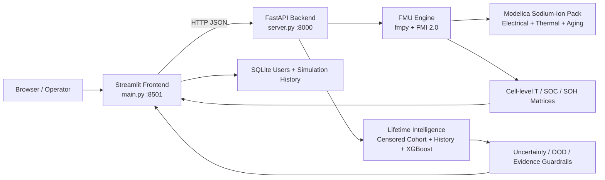

# Sodium Twin：钠离子电池全生命周期数字孪生平台

Sodium Twin 是一个面向钠离子电芯、模组与电池包的工程化数字孪生原型。平台把 **Modelica/FMU 电—热物理仿真**、**数据驱动寿命预测**、**不确定性与域外检测**、**三维空间诊断** 和 **可交互Web控制台** 集成到同一套系统中。

> 当前定位：可用于物理仿真、方案比较、热安全诊断、寿命风险区间与公司数据接入演示；尚不能在缺少公司实测老化数据时，对特定50Ah电芯承诺精确RUL。

## 1. 系统能力

- 多规格钠离子电池包 FMU 联合仿真，当前仓库包含10种可运行规格。
- 恒流或CSV时变电流工况，支持环境温度、冷却液、换热系数、SOC/SOH和故障参数配置。
- 输出包电压、电流、SOC、SOH、温度包络、功率能力、吞吐量和等效循环等KPI。
- 输出电芯级温度、SOC和SOH空间矩阵，并提供交互式三维热场与最差电芯定位。
- 基于RWTH商业钠离子电池队列的删失感知RUL预测，返回预测值、宽区间、证据覆盖和OOD告警。
- 可选XGBoost短期趋势校准；历史不足或模型不可用时，自动降级到队列与历史速率融合。
- 工业风Streamlit前端、FastAPI接口、SQLite账户与任务记录、PDF工程报告。

## 2. 总体架构



系统采用前后端双进程：前端不直接加载FMU，而是通过HTTP调用后端。这样可把Streamlit会话状态与C++/FMU运行时隔离，并为后续容器化、远程计算和多用户部署保留边界。

## 3. 两条核心技术链

### 3.1 物理仿真链

1. 前端形成电池包、运行工况、热管理和故障配置。
2. `server.py` 按 `Ns × Np` 选择对应FMU，并缓存数字孪生引擎。
3. `FMUClient` 通过FMI 2.0 Co-Simulation运行Modelica模型。
4. FMU输出包级状态以及 `pack.TCell[s,p]`、`pack.SOCCell[s,p]`、`pack.SOHCell[s,p]`。
5. Python重组时间序列和三维矩阵，计算KPI与诊断告警。
6. 前端渲染运行曲线、热场、SOH空间分布和工程报告。

当前FMU可运行规格：

| 规格 | 电芯数 | 典型用途 |
|---|---:|---|
| 8S2P | 16 | 微型模组、两轮车、便携储能 |
| 16S2P / 16S4P | 32 / 64 | 模组和小型储能 |
| 48S2P | 96 | 中压电池包 |
| 96S1P / 96S2P | 96 / 192 | 乘用车或400V平台 |
| 128S1P / 128S2P | 128 / 256 | 中大型动力/储能系统 |
| 192S2P | 384 | 高压储能簇 |
| 288S1P | 288 | 高压动力电池包 |

`Ns/Np` 是FMU编译期结构参数。新增规格必须从Modelica重新导出FMU，不能在运行时修改数组维度。

### 3.2 寿命智能链

寿命服务不是单一黑盒回归器，而是四层融合：

- **公开队列证据**：RWTH商业钠离子老化DOD100子集，当前处理为47只电芯、54,552行循环特征、15类工况。
- **删失感知标签**：对90%、85%、80% EOL阈值显式保留右删失样本，不为未达到EOL的电芯伪造寿命标签。
- **个体历史趋势**：上传历史SOH后估计资产自身衰减速率，并按电热/SOC应力调整。
- **AI短期校准**：满足历史点数和SOH门禁时，使用XGBoost残差模型校准已验证的短期轨迹。

API同时返回：

- RUL循环数、预计EOL循环和按每日循环换算的天数；
- 基于匹配队列速率分位数的RUL区间；
- 置信度、OOD分数和超出训练域的特征；
- 队列、历史和AI各自的融合权重；
- EOL事件数、右删失数、匹配电芯和使用边界；
- 单调SOH预测轨迹与工程告警。

当前证据边界：

| EOL阈值 | 实测事件 | 右删失 | 事件覆盖率 |
|---|---:|---:|---:|
| 90% SOH | 23 / 47 | 24 | 48.9% |
| 85% SOH | 14 / 47 | 33 | 29.8% |
| 80% SOH | 7 / 47 | 40 | 14.9% |

RWTH训练电芯额定容量为1.2Ah且当前队列为DOD100。公司50Ah或部分SOC窗口电芯会被标记为OOD，并返回较低置信度和更宽区间；这是安全门禁，不是程序错误。

## 4. 关键技术点

| 技术点 | 实现位置 | 工程价值 |
|---|---|---|
| FMI 2.0联合仿真 | `utils/fmu_interface.py` | Python控制Modelica黑盒并动态提取电芯矩阵 |
| 多FMU按需加载 | `server.py` | 按拓扑选择模型，避免后端启动时加载所有规格 |
| 电—热—老化耦合 | `models/simulation_engine.py` | 统一电压、热状态、SOH损失与功率边界 |
| 冷却和时变工况 | `models/simulation_engine.py` | 把流量、UA、入口温度和CSV电流传入FMU |
| 故障注入 | Modelica + `views/sidebar_view.py` | 支持软短路、接触电阻、容量、内阻和冷却故障场景 |
| 删失感知EOL | `models/soh_ai/lifetime.py` | 不把未达到阈值的电芯错误当作完整寿命样本 |
| 严格按电芯回测 | `utils/evaluate_lifetime_backtest.py` | 防止同一电芯循环泄漏到训练与测试 |
| OOD与置信度门禁 | `models/soh_ai/lifetime.py` | 对50Ah、SOC窗口和未知工况限制结论强度 |
| 3D空间诊断 | `views/spatial_view.py` | 模组化排布、冷板、母排、色标和热点/最差电芯定位 |
| 前后端错误隔离 | `utils/api_client.py` | 统一超时、HTTP错误和无效JSON处理 |

## 5. 目录结构

```text
Battery_Desktop/
├── main.py                         # Streamlit入口
├── server.py                       # FastAPI入口与请求协议
├── requirements.txt                # 平台基础运行依赖
├── requirements-data.txt           # 数据预处理/训练依赖
├── BatterySystemEngineering.mo     # 当前Modelica模型库入口
├── mo_system_models/               # 各规格系统模型
├── fmu_models/                     # 已导出的FMI 2.0 Co-Simulation模型
├── assets/
│   ├── styles.css                  # 工业控制台设计系统
│   └── templates/cycle_profile.csv # 时变工况模板
├── config/                         # 主题和CSS加载
├── views/
│   ├── login_view.py               # 登录/注册
│   ├── sidebar_view.py             # 仿真配置侧栏
│   ├── dashboard_view.py           # 四工作区和结果页
│   ├── lifetime_view.py            # 寿命预测与模型证据
│   ├── spatial_view.py             # 3D热场和SOH空间视图
│   └── components.py               # 通用展示组件
├── models/
│   ├── simulation_engine.py        # 数字孪生编排与KPI
│   ├── data_structures.py          # 请求、时序与KPI数据结构
│   ├── aging_algorithm.py          # 半经验老化备用模型
│   ├── physics_lib.py              # OCV、熵热等物理函数
│   ├── soh_ai/                     # 数据管线、模型、训练、评估和寿命服务
│   ├── data/processed/             # 处理后的特征与质量报告
│   └── weights/                    # 模型、缩放器和验证产物
├── utils/
│   ├── fmu_interface.py            # FMU发现、加载、求解与矩阵重组
│   ├── api_client.py               # 前端HTTP客户端
│   ├── data_parser.py              # CSV工况解析
│   ├── db_manager.py               # SQLite账户与任务历史
│   ├── report_generator.py         # PDF报告
│   └── evaluate_* / audit_*        # 审计和回测脚本
├── test/                            # 物理、API、数据和寿命测试
└── docs/
    ├── sodium_server_training.md
    └── PAPER_ROADMAP_JPS_APPLIED_ENERGY.md
```

## 6. 环境与安装

### 6.1 基础要求

- Windows 10/11；当前FMU包含Windows二进制。
- Python 3.10。
- OpenModelica；当前代码默认从 `D:\openmodelica\bin` 加载运行时DLL。
- 建议至少8GB内存；大规格FMU或训练任务建议使用服务器。

### 6.2 创建环境

PowerShell：

```powershell
cd F:\Battery_Desktop
python -m venv .venv
.\.venv\Scripts\Activate.ps1
python -m pip install --upgrade pip
python -m pip install -r requirements.txt
```

如需训练BiLSTM/Transformer或加载依赖PyTorch的AI产物，请根据本机/服务器CUDA版本另行安装PyTorch。基础FMU仿真、队列寿命服务和XGBoost数据流程不应强制绑定GPU版PyTorch。

### 6.3 模型与数据

- FMU文件放在 `fmu_models/`，命名为 `SystemForFMI_<Ns>x<Np>.fmu`。
- 寿命特征表默认读取 `models/data/processed/sodium_ion/feature_table.parquet`。
- 寿命模型目录可通过环境变量覆盖：

```powershell
$env:SODIUM_LIFETIME_MODEL_DIR = "F:\Battery_Desktop\models\weights\sodium_ion\<validated_run>"
```

- 前端后端地址可覆盖：

```powershell
$env:BATTERY_API_BASE = "http://127.0.0.1:8000"
```

## 7. 启动与使用

平台需要两个终端。

终端1：

```powershell
cd F:\Battery_Desktop
.\.venv\Scripts\Activate.ps1
python server.py
```

终端2：

```powershell
cd F:\Battery_Desktop
.\.venv\Scripts\Activate.ps1
streamlit run main.py
```

访问：

- 前端：`http://127.0.0.1:8501`
- API文档：`http://127.0.0.1:8000/docs`
- 默认本地账户：`admin / 1234`

生产或公司内网部署前必须修改默认密码，并把SQLite身份认证替换为正式认证系统。

### 7.1 运行物理仿真

1. 选择已有FMU的串并联规格。
2. 设置单体容量和恒流工况，或上传CSV时变工况。
3. 设置环境温度、初始温度、冷却液温度/流量和UA。
4. 设置初始SOC/SOH；如需验证异常场景，启用故障注入。
5. 点击“启动数字孪生解算”。
6. 在运行总览、电热与功率、三维空间诊断中查看结果。

CSV必须包含：

```csv
Time,Current
0,0
10,50
60,50
61,0
100,-30
```

`Time`单位为秒且严格递增；`Current > 0` 表示放电，`Current < 0` 表示充电。

### 7.2 运行寿命分析

1. 输入当前SOH、当前循环、EOL阈值和每日等效循环。
2. 输入温度、温差、充放电倍率、SOC窗口和额定容量。
3. 可上传含 `cycle_index,soh_pct` 的历史CSV；至少8个有效历史点才可能启用短期AI趋势校准。
4. 点击“执行寿命预测”。
5. 同时阅读RUL、区间、置信度、OOD、融合来源和警告，不应只读取单点RUL。

## 8. API

| 方法 | 路径 | 说明 |
|---|---|---|
| GET | `/api/v1/health` | 后端和可用FMU健康状态 |
| GET | `/api/v1/fmu/configurations` | 可选Ns/Np以及FMU就绪状态 |
| POST | `/api/v1/simulate/predict` | 执行物理仿真并返回KPI、时序和空间矩阵 |
| GET | `/api/v1/lifetime/evidence` | 返回数据覆盖、EOL事件和模型指标 |
| POST | `/api/v1/lifetime/predict` | 返回删失感知RUL、区间、OOD和轨迹 |

示例：

```powershell
$body = @{
  current_soh_pct = 95
  current_cycle = 500
  eol_soh_pct = 80
  cycles_per_day = 1
  scenario = @{
    temperature_c = 25
    temperature_spread_c = 3
    c_rate_charge = 1
    c_rate_discharge = 1
    soc_min_pct = 0
    soc_max_pct = 100
    nominal_capacity_ah = 50
  }
  history = @()
} | ConvertTo-Json -Depth 6

Invoke-RestMethod `
  -Uri http://127.0.0.1:8000/api/v1/lifetime/predict `
  -Method Post -ContentType application/json -Body $body
```

## 9. 测试与验证

```powershell
python -m pytest test\ -q
python -m unittest discover test\ -v
```

当前测试覆盖：

- 日历/循环老化和基础物理函数；
- FMU请求协议、时变工况与KPI契约；
- 钠电数据审计、特征与模型结构；
- 寿命API、右删失标签和严格按电芯留一回测；
- 残差模型与门禁逻辑。

服务器验证摘要位于：

```text
models/weights/sodium_ion/server_artifacts_20260724/
  server_runs/lifetime_validation_20260725/VALIDATION_REPORT.md
```

## 10. Modelica/FMU开发流程

1. 在OMEdit中加载 `BatterySystemEngineering.mo`（或项目对应的钠电模型库）。
2. 打开 `mo_system_models/` 中的系统模型或参数化模板。
3. 设置编译期 `Ns/Np`，检查变量命名仍满足 `pack.*` 约定。
4. 导出FMI 2.0 Co-Simulation FMU。
5. 重命名为 `SystemForFMI_<Ns>x<Np>.fmu` 并放入 `fmu_models/`。
6. 重启FastAPI；引擎为进程内缓存，替换FMU后不会自动刷新。

## 11. 已知限制

- 当前FMU运行时是Windows限定；Linux部署需重新导出包含Linux二进制的FMU。
- Modelica参数能否在运行时覆盖取决于FMU变量的variability/causality；更换拓扑必须重新导出。
- 热补偿模型、缩放器和scikit-learn版本必须一致；不一致时平台会降级使用FMU结果，但生产环境应重新导出兼容产物。
- 80% EOL事件稀少，远期RUL主要是带宽区间的工程外推。
- 已验证的AI预测跨度为128循环；超出部分不能作为同等证据强度的模型预测。
- 公司50Ah电芯相对1.2Ah RWTH训练电芯属于域外对象，必须用公司循环数据校准和外部验证。
- PDF当前使用拉丁字体兼容策略，中文报告仍需嵌入Unicode字体后再作为正式交付物。
- 本项目是工程和研究原型，不是经过功能安全、网络安全或计量认证的生产BMS。

## 12. 论文工作

面向 Journal of Power Sources / Applied Energy 的研究路线、实验门槛和交接说明见：

[`docs/PAPER_ROADMAP_JPS_APPLIED_ENERGY.md`](docs/PAPER_ROADMAP_JPS_APPLIED_ENERGY.md)
